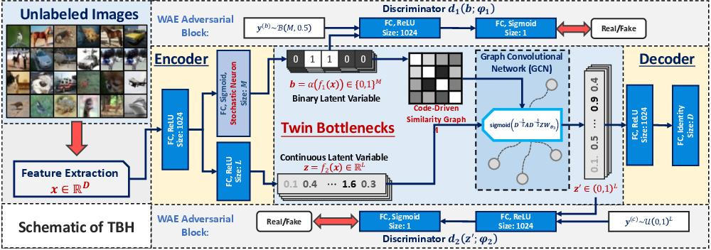

# TBH(Auto-Encoding Twin-Bottleneck Hashing) replication

This is the replication code for our final homework project.

## Requirements

```angular2
python=3.6
tensorflow>=2.0 (tested with tf2.1)
scipy
sklearn
```

## My New Environment

```
conda create -n tbhgpu python=3.6

conda install cudatoolkit=11.2 cudnn=8.1 scipy scikit-learn

pip install tensorflow-gpu==2.6.0 -i https://pypi.tuna.tsinghua.edu.cn/simple

pip install keras==2.6.0
```

## Data

This work supports `tf.data.TFRecordDataset` as the data feed. 
I provide the following data as training examples:

* Cifar-10 

If one needs to run experiments on other datasets, please refer to [`util/data/make_data.py`](./util/data/make_data.py) to build TFRecords.

Please organize the data folder as follows:

```angular2
data
  |-cifar10 (or other dataset names)
    |-train.tfrecords
    |-test.tfrecords
```



Simply run

```angular2
python ./run_tbh.py
```

to train the model.

The resulting checkpoints will be placed in `./result/set_name/model/date_of_today` with tensorboard events in `./result/set_name/log/date_of_today`.

The mAP results shown on tensorboard are just for illustration (the actual score would be slightly higher than the ones on tensorboard), 
since I do not update all dataset codes upon testing. Please kindly evaluate the results by saving the proceeded codes after training.


## Original author reference:

https://github.com/ymcidence/TBH.